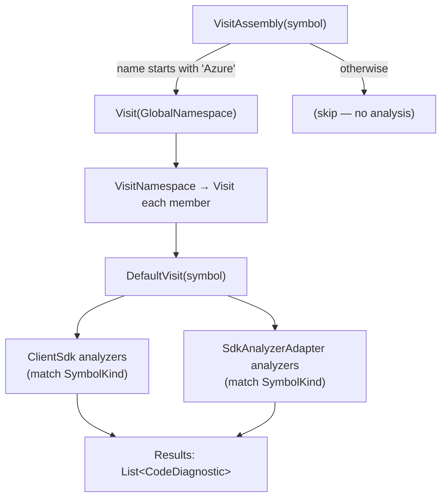

# 8. Analysis & Diagnostics

> [!summary]
> Alongside rendering the API surface, the parser can run Azure SDK **guideline checks** against the
> assembly. `Analyzer` visits the symbols, runs a set of analyzers, and collects
> [[token-model#CodeDiagnostic|CodeDiagnostic]]s that APIView shows inline on the review.

- **File:** `src/dotnet/APIView/APIView/Analysis/Analyzer.cs`
- **Namespace:** `APIView.Analysis`
- **Base class:** Roslyn `SymbolVisitor`
- **Toggle:** controlled by the `runAnalysis` argument (default `true`) threaded from the CLI →
  `CodeFileBuilder.Build` → `Analyzer.VisitAssembly`. See [[processing-pipeline#Command-line interface]].

## What it runs

`Analyzer` aggregates two families of rules:

| Family | Analyzers | Context type |
|---|---|---|
| **`Azure.ClientSdk.Analyzers`** | `ClientMethodsAnalyzer`, `ClientConstructorAnalyzer`, `ClientOptionsAnalyzer`, `BannedAssembliesAnalyzer` | `ISymbolAnalysisContext` |
| **`Azure.SdkAnalyzers`** | `TypeNameAnalyzer` (via [[#SdkAnalyzerAdapter]]) | `SymbolAnalysisContext` |

These enforce Azure SDK [design guidelines](https://azure.github.io/azure-sdk/dotnet_introduction.html)
— client method shapes, constructor patterns, options-class conventions, banned assembly references,
and type-naming rules.

## How it walks

- **`VisitAssembly`** only descends when the assembly name **starts with `"Azure"`**. Non-Azure
  packages are rendered but **not** linted.
- **`VisitNamespace`** recurses into every namespace/type member.
- **`DefaultVisit`** is invoked per symbol. For each analyzer whose `SymbolKinds` include the current
  symbol's kind, it calls `Analyze(...)`, passing a context that appends to the shared `Results` list.

## How a diagnostic is recorded

Both families ultimately produce a [[token-model#CodeDiagnostic|CodeDiagnostic]] with:

- `DiagnosticId` = the rule id (e.g. `AZC0012`),
- `TargetId` = `symbol.GetId()` — the same id used for the symbol's `LineId`, so APIView can attach the
  diagnostic to the right line,
- `Text` = the rule's message,
- `HelpLinkUri` = the rule's help link.

The inner `Context : ISymbolAnalysisContext` (for ClientSdk analyzers) implements `ReportDiagnostic`
by translating a Roslyn `Diagnostic` into a `CodeDiagnostic`.

## SdkAnalyzerAdapter

- **File:** `src/dotnet/APIView/APIView/Analysis/SdkAnalyzerAdapter.cs`

`Azure.ClientSdk.Analyzers` and `Azure.SdkAnalyzers` use **different** context abstractions. This
adapter wraps an `Azure.SdkAnalyzers.SymbolAnalyzerBase`, exposes its `SymbolKinds` /
`SupportedDiagnostics`, and provides an `Analyze(symbol, results)` that builds a real Roslyn
`SymbolAnalysisContext` whose `reportDiagnostic` callback appends `CodeDiagnostic`s to the results list.
It lets both analyzer families run side-by-side in one pass.

## Where the results go

`CodeFileBuilder.Build` assigns `codeFile.Diagnostics = analyzer.Results.ToArray()` after the symbol
walk. They serialize into the token file and render as inline annotations in APIView. See
[[codefilebuilder#The entry point Build]].

## Next

Build, run, and test the whole thing in [[build-test-run]].
