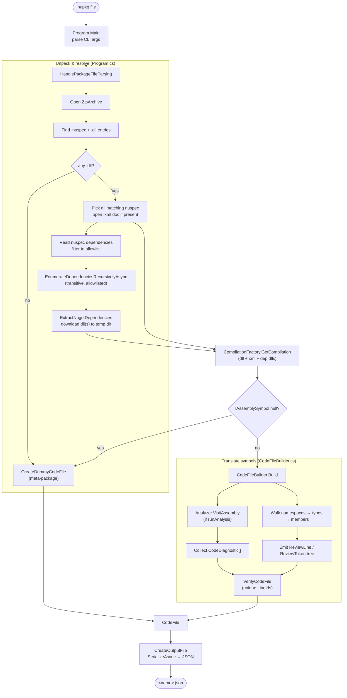
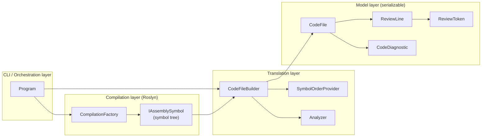

# 2. Architecture

> [!summary]
> The parser is a thin CLI shell around two responsibilities: **(1)** unpack the `.nupkg` and load the
> assembly into Roslyn, and **(2)** walk the resulting symbol tree to emit tokens. Most of the heavy
> lifting types live in the sibling `APIView` project and are reused here.

## Components

| Component | Type | Project | Responsibility | Deep dive |
|---|---|---|---|---|
| `Program` | static class | csharp-api-parser | CLI parsing, unzip `.nupkg`, resolve dependencies, orchestrate | [[processing-pipeline]] |
| `CompilationFactory` | static class | APIView | Build a Roslyn `CSharpCompilation` and return the `IAssemblySymbol` | [[compilation-and-dependencies]] |
| `CodeFileBuilder` | class | csharp-api-parser | Translate symbols into a `CodeFile` tree of `ReviewLine`/`ReviewToken` | [[codefilebuilder]] |
| `CodeFileBuilderSymbolOrderProvider` | class | APIView | Decide the order of types/members/namespaces | [[symbol-ordering]] |
| `Analyzer` | class | APIView | Run Azure SDK guideline rules, collect `CodeDiagnostic`s | [[analysis-and-diagnostics]] |
| `CodeFile` / `ReviewLine` / `ReviewToken` | model classes | APIView | The output object graph that gets serialized to JSON | [[token-model]] |
| `DependencyInfo` | readonly struct | APIView | A `(Name, Version)` pair for a package dependency | [[compilation-and-dependencies#DependencyInfo]] |
| `SymbolExtensions.GetId` | extension method | APIView | Produce a stable identifier string for any symbol | [[codefilebuilder#Identifiers LineId and NavigateToId]] |

> [!tip] Project boundary
> Everything in the table marked **APIView** comes from `src/dotnet/APIView/APIView/APIView.csproj`,
> referenced via `<ProjectReference>` in `CSharpAPIParser.csproj`. The parser deliberately keeps its
> own surface area tiny (`Program` + `CodeFileBuilder`) and reuses the shared APIView library so the
> model stays consistent with the rest of the APIView ecosystem.

## Detailed data flow

## Layered view

## Key design decisions

- **Parse metadata, not source.** Working from the compiled `.dll` guarantees the review matches the
  shipped surface. Roslyn exposes the assembly as an `IAssemblySymbol` tree that is easy to walk.
- **Allowlist for dependencies.** Only a few Azure foundational packages (`Azure.Core`,
  `System.ClientModel`, `System.Memory.Data`) are resolved and added as references. This keeps the
  compilation lightweight and avoids pulling the whole transitive graph. See
  [[compilation-and-dependencies#The dependency allowlist]].
- **Internals are visible to the compilation.** `CompilationFactory` sets
  `MetadataImportOptions.Internal` so the parser can honor `InternalsVisibleTo` and `[Friend]`
  members. Visibility filtering then happens deliberately in `CodeFileBuilder`.
- **Tree of lines, not flat tokens.** The output mirrors code structure (namespace → type → member),
  which enables granular navigation, contextual diffing, and cross-language linking. See
  [[token-model#Why a tree]].
- **Graceful degradation.** If a package has no `.dll` or no assembly symbol, the tool still emits a
  valid "meta-package" `CodeFile` with an explanatory line instead of failing. See
  [[processing-pipeline#Edge cases and meta-packages]].
- **Stable identity + uniqueness.** Every meaningful line gets a `LineId` derived from the symbol, and
  `VerifyCodeFile` asserts those IDs are unique so comments and navigation never collide.

## Next

Walk the run end-to-end in [[processing-pipeline]], or jump straight to the translator in
[[codefilebuilder]].
