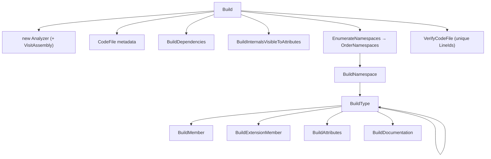

# 4. CodeFileBuilder

> [!summary]
> `CodeFileBuilder` is the core of the parser. Given a Roslyn `IAssemblySymbol`, it walks the symbol
> tree (namespaces → types → members) and emits a [[token-model|CodeFile]]: a tree of `ReviewLine`s,
> each made of `ReviewToken`s. It also triggers the [[analysis-and-diagnostics|Analyzer]] and validates
> the result.

- **File:** `CSharpAPIParser/TreeToken/CodeFileBuilder.cs`
- **Namespace:** `CSharpAPIParser.TreeToken`
- **Parser version:** `public const string CurrentVersion = "29.91"` — stamped onto every `CodeFile`
  as `ParserVersion`. **Bump this when output changes** so APIView can tell revisions apart.

> [!warning] Not the legacy builder
> A different `CodeFileBuilder` exists at `src/dotnet/APIView/APIView/Languages/CodeFileBuilder.cs`
> and produces the old flat-token format. This parser uses **only** the `TreeToken` one documented here.

## The entry point: `Build`

```csharp
public CodeFile Build(IAssemblySymbol assemblySymbol, bool runAnalysis, List<DependencyInfo>? dependencies)
```

Steps:

1. Store the assembly (`_assembly`) — used later to decide which type references are *internal* links.
2. Create an [[analysis-and-diagnostics|Analyzer]]; if `runAnalysis`, call `analyzer.VisitAssembly`.
3. Create the `CodeFile` with metadata: `Language = "C#"`, `ParserVersion = CurrentVersion`,
   `PackageName`, and `PackageVersion` (from [[#Package version]]).
4. `BuildDependencies(...)` → emit the **Dependencies** section (if any).
5. `BuildInternalsVisibleToAttributes(...)` → emit the **Exposes internals to:** section (if any).
6. For each namespace (ordered by [[symbol-ordering|SymbolOrderProvider]]): types in the global
   namespace are emitted directly; everything else goes through `BuildNamespace`.
7. Attach diagnostics: `codeFile.Diagnostics = analyzer.Results.ToArray()`.
8. `VerifyCodeFile(codeFile)` → assert unique `LineId`s. (See [[#Validation]].)



## Walking the symbol tree

### Namespaces

- **`EnumerateNamespaces`** does an iterative (stack-based) depth-first traversal from the global
  namespace, yielding only namespaces that contain at least one accessible (public-ish) type
  (`HasAnyPublicTypes`).
- **`BuildNamespace`** emits `namespace Foo.Bar {`, recurses into ordered types as **children**, then
  emits the closing `}` line and a trailing empty line. A namespace whose types are *all* hidden is
  itself marked `IsHidden` (`HasOnlyHiddenTypes`).
- **`BuildNamespaceName`** recursively prepends parent namespace segments separated by `.`.

### Types

**`BuildType`** handles classes, structs, interfaces, enums, and delegates:

- Skips inaccessible types early (`IsAccessible`).
- Emits, in order: documentation ([[#Documentation]]), attributes ([[#Attributes]]), visibility,
  modifiers, the type keyword, and the name.
- **Class modifiers** (`BuildClassModifiers`): `abstract`, `static`, `sealed`.
- **Structs**: emits `readonly` when applicable.
- **Delegates**: emitted as a single line ending in `;` (no body) and returns early.
- **Base types & interfaces** (`BuildBaseType`): appends `: BaseType, IInterface1, IInterface2`,
  skipping `System.Object`/special base types and inaccessible interfaces.
- Recurses into nested types and members as **children**, then emits the closing `}` context line.
- The type-name token is tagged with a `NavigationDisplayName` (so it shows in the nav tree) and a
  render class equal to the type kind (`class`, `struct`, …) for styling.

### Members

**`BuildMember`** emits fields, properties, methods, events, and constructors:

- Skips implicitly declared members, inaccessible members, and property/event **accessor** methods
  (get/set/add/remove/raise) — those are folded into their property/event rendering.
- Builds documentation + attributes, then the member signature via [[#DisplayName and MapToken]].
- Adds a trailing `,` for **enum fields**, a trailing `;` for most members, and **nothing** for
  properties (their `{ get; set; }` is already rendered).
- Tags the member-name token with a render class equal to the symbol kind for styling.

## DisplayName and MapToken

This is where Roslyn's formatting meets APIView's token model.

- **`DisplayName`** asks Roslyn to render a symbol into `SymbolDisplayPart`s using the builder's
  `_defaultDisplayFormat`, then converts each part to a `ReviewToken` via `MapToken`.
  - For **properties** it special-cases accessors: an `internal` setter is dropped from the public
    view, and a line break inside the property pushes following tokens onto a child `ReviewLine`.
- **`MapToken`** maps a `SymbolDisplayPartKind` to a [[token-model#TokenKind|TokenKind]]:
  - type names → `TypeName`; keywords → `Keyword`; punctuation → `Punctuation`;
    string literals → `StringLiteral`; property/method/field/event/enum-member names → `MemberName`;
    spaces set `HasSuffixSpace` on the previous token; everything else → `Text`.
  - **Cross-reference links:** when a part is a named type **defined in the same assembly** (and isn't
    the symbol being declared), `MapToken` sets `NavigateToId` to that type's `GetId()`, making the
    rendered name a clickable link. References to *external* types are not linked.

`_defaultDisplayFormat` is a carefully tuned `SymbolDisplayFormat` controlling nullable annotations,
default values, parameter names, generic constraints/variance, accessibility, and more — it's what
makes the signatures read like idiomatic C#.

## Accessibility and visibility

- **`IsAccessible`** — `public`/`protected`/`protected internal` are accessible; `internal` is
  accessible **only** if marked `[Friend]`; explicit interface implementations are accessible if their
  interface is. This is what limits the review to the consumer-visible surface (plus deliberate
  internal exposure).
- **`ToEffectiveAccessibility`** — collapses `protected internal`/`private protected` to the keyword a
  consumer cares about.
- **`NeedsAccessibility`** — suppresses redundant modifiers (e.g. interface members, enum fields).
- **`IsHiddenFromIntellisense`** — true for `[EditorBrowsable(Never)]` members and explicit interface
  implementations; such lines are emitted but flagged `IsHidden` so APIView can collapse them.
- **`InternalsVisibleTo`** — `BuildInternalsVisibleToAttributes` lists assemblies the package exposes
  internals to (skipping `.Tests`, `.Perf`, and `DynamicProxyGenAssembly2`).

## Attributes

**`BuildAttributes`** renders `[Attribute(args)]` lines:

- Skips inaccessible attributes (except `[Friend]` and `System.Diagnostics.CodeAnalysis.*`) and a
  hard-coded list of noise attributes via **`IsSkippedAttribute`** (e.g. `DebuggerStepThrough`,
  `AsyncStateMachine`, `CompilerGenerated`, `Nullable`, `EditorBrowsable`, …).
- Strips the `Attribute` suffix from the name, renders constructor + named arguments via
  **`BuildTypedConstant`** (handles null, enums, `typeof(...)`, arrays, strings, primitives), and
  **de-duplicates** identical attribute lines (a codegen artifact on partial types).

## Documentation

**`BuildDocumentation`** pulls the symbol's XML doc comment (`GetDocumentationCommentXml`, populated
from the package's `.xml` file), splits it into lines, and emits each as a `// ...` comment token with
`IsDocumentation = true`. Empty/whitespace docs are skipped.

## Extension members (C# 14 extension blocks)

Newer C# compiles `extension(...)` blocks into hidden nested containers named `<G>$` / `<M>$`.
The builder detects and "un-lowers" them so the review reads like source:

- **`IsExtensionMemberContainer`** — recognizes the compiler-generated container by name pattern and
  the presence of an extension marker method.
- **`IsExtensionMarkerMethod`** — the `<Extension>$` marker method (void, ≥1 parameter) that carries
  the extension's receiver type.
- **`BuildExtensionMember`** — emits an `extension(ReceiverType name) { ... }` block, lifting the real
  members out of the container (and any nested types) while skipping the marker.

This logic is wrapped in a `try/catch` in `BuildType`; if detection throws, it falls back to rendering
the type normally and logs to `stderr`.

## Identifiers: LineId and NavigateToId

- **`GetLineId`** / `SymbolExtensions.GetId` produce a stable, human-readable identifier for a symbol
  (e.g. `Azure.Storage.Blobs.BlobServiceClient.BlobServiceClient(System.String)`), using a dedicated
  `SymbolDisplayFormat`. Explicit interface implementations are prefixed with the interface's id to
  stay unique.
- `LineId` is used for commenting, navigation, and as the diff anchor; `NavigateToId` turns a token
  into a hyperlink to another line's `LineId`. See [[token-model]].

## Package version

**`GetPackageVersion`** reads the `[AssemblyInformationalVersion]` attribute and strips any build
metadata after `+` (e.g. `1.2.3+sha` → `1.2.3`). If absent/blank, `Build` falls back to the assembly
identity version. Unit-tested in `CodeFileBuilderTests.cs` (see [[build-test-run#Tests]]).

## Validation

**`VerifyCodeFile`** recursively collects every non-empty `LineId` and throws
`InvalidOperationException` if any duplicates exist. Unique line ids are essential — comments and
navigation target lines by id — so this is a hard correctness gate enforced at build time and covered
by the `NoDuplicateLineIds` test.

## Helper: `CodeFileBuilderEnumFormatter`

A nested `AbstractSymbolDisplayVisitor` that renders enum constant values used as attribute arguments,
including OR-combined `[Flags]` values (`A | B | C`).

## Collaborators

| Uses | For |
|---|---|
| [[symbol-ordering|`SymbolOrderProvider`]] | ordering namespaces/types/members |
| [[analysis-and-diagnostics|`Analyzer`]] | producing `CodeDiagnostic`s |
| [[token-model|`ReviewLine` / `ReviewToken`]] | the emitted output |
| `SymbolExtensions.GetId` | stable identifiers |
| Roslyn `SymbolDisplay*` | rendering signatures |

## Next

See the shape of what it emits in [[token-model]].
