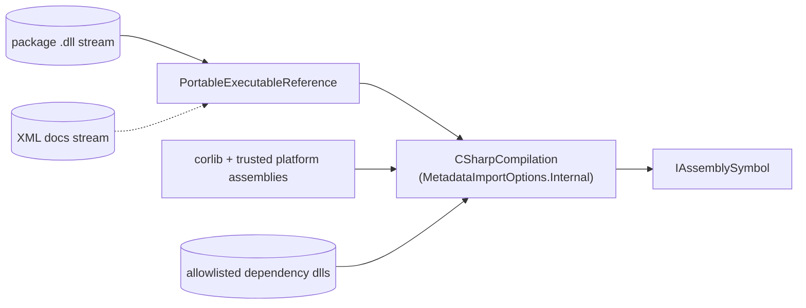

# 6. Compilation & Dependencies

> [!summary]
> Before any symbols can be walked, the package's `.dll` must be loaded into a Roslyn compilation.
> `CompilationFactory` does that — turning a DLL stream (plus optional XML docs and a few dependency
> DLLs) into an `IAssemblySymbol` that [[codefilebuilder|CodeFileBuilder]] consumes.

## CompilationFactory

- **File:** `src/dotnet/APIView/APIView/Languages/CompilationFactory.cs`
- **Namespace:** `APIView`

```csharp
public static IAssemblySymbol GetCompilation(
    Stream stream, Stream documentationStream, IEnumerable<string> dependencyPaths = null)
```

What it does:

1. **Copy the DLL** into a `MemoryStream` and create a `PortableExecutableReference` from it. If a
   documentation stream is provided, wrap it in an `XmlDocumentationProvider` and attach it so doc
   comments are available later (`GetDocumentationCommentXml`, used by
   [[codefilebuilder#Documentation]]).
2. **Create a `CSharpCompilation`** with:
   - `OutputKind.DynamicallyLinkedLibrary`, and crucially
   - `MetadataImportOptions.Internal` — so **internal** members are imported, enabling
     `InternalsVisibleTo`/`[Friend]` handling. (Visibility filtering is a deliberate decision made later
     in [[codefilebuilder#Accessibility and visibility]], not a side effect of what Roslyn imports.)
3. **Add core references:**
   - `corlib` (the runtime's `System.Private.CoreLib` via `typeof(object).Assembly.Location`),
   - every **trusted platform assembly** located in the runtime folder, plus a short
     [[#The dependency allowlist|allowlist]] of extras.
4. **Add the resolved dependency DLLs** passed in by `Program` — but only those that **exist** and are
   on the allowlist.
5. Return `compilation.GetAssemblyOrModuleSymbol(reference)` cast to `IAssemblySymbol`.



> [!tip] Convenience overload
> `GetCompilation(string file)` opens a file path and delegates to the stream overload — handy in
> tests and ad-hoc usage.

## The dependency allowlist

`CompilationFactory` only adds dependency assemblies whose file name (without extension) is in:

```text
Microsoft.Bcl.AsyncInterfaces
System.ClientModel
System.Memory.Data
```

`Program` uses a closely related allowlist when scanning the nuspec and resolving downloads:

```text
Azure.Core
System.ClientModel
System.Memory.Data
```

**Why an allowlist at all?** A package's public signatures reference only a handful of foundational
types (e.g. `Azure.Core`'s `Response<T>`, `System.ClientModel` primitives). Those references must
resolve for Roslyn to produce accurate symbols, but pulling the *entire* transitive graph would be slow
and pointless. The allowlist is the minimal set needed for correct rendering. See
[[processing-pipeline#Dependency resolution]] for how `Program` discovers and downloads them.

## DependencyInfo

- **File:** `src/dotnet/APIView/APIView/Languages/DependencyInfo.cs`
- A small `readonly struct` holding `Name` and `Version`.

Used to:

- carry resolved dependencies from `Program` into `CompilationFactory`, and
- render the **Dependencies** section of the review (`CodeFileBuilder.BuildDependencies`), where each
  dependency's version token is marked `SkipDiff = true` so version bumps don't show up as API changes.

> [!note] De-duplication
> `Program.DependencyInfoComparer` treats two `DependencyInfo`s as equal when their **names** match
> (case-insensitive). This is what stops `EnumerateDependenciesRecursivelyAsync` from looping or listing
> the same dependency twice.

## How `Program` feeds this step

Recap of the hand-off (full detail in [[processing-pipeline]]):

1. `Program` reads dependencies from the nuspec, filters to the allowlist, and walks transitive deps.
2. `Program.ExtractNugetDependencies` downloads the allowlisted packages from nuget.org and extracts
   their DLLs to a temp folder.
3. `Program` passes the DLL stream, the XML doc stream, and the temp DLL paths to
   `CompilationFactory.GetCompilation`.
4. The returned `IAssemblySymbol` goes to `CodeFileBuilder.Build`.

## Next

Before symbols become lines, they're sorted — see [[symbol-ordering]].
