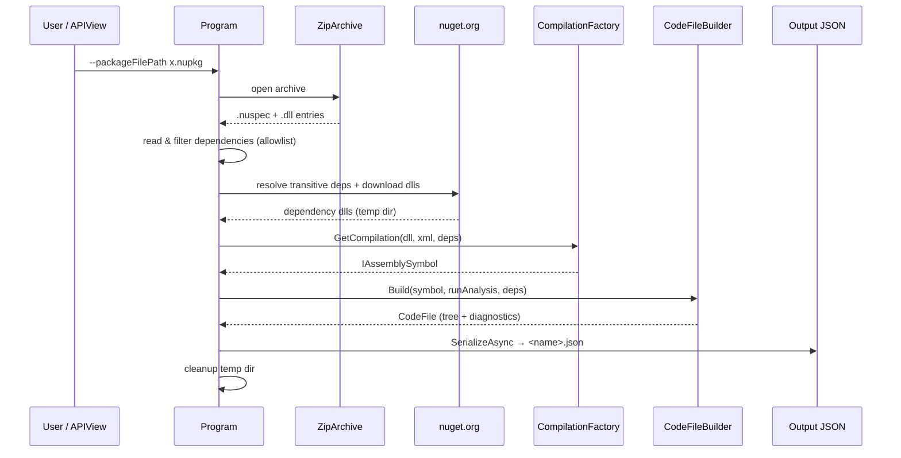

# 3. Processing Pipeline

> [!summary]
> `Program.cs` is the orchestrator. It defines the CLI, unpacks the `.nupkg`, resolves a small set of
> allowlisted dependencies, builds a Roslyn compilation, hands the assembly to [[codefilebuilder|CodeFileBuilder]],
> and serializes the resulting [[token-model|CodeFile]] to JSON.

File: `CSharpAPIParser/Program.cs` — a top-level `static class Program`.

## Command-line interface

Built with `System.CommandLine`. The root command is *"Parse C# Package (.nupkg) to APIView Tokens"*.

| Option / argument | Kind | Required | Meaning |
|---|---|---|---|
| `--packageFilePath` | `Option<FileInfo>` (must exist) | **Yes** | The `.nupkg` to parse. |
| `--outputDirectoryPath` | `Option<DirectoryInfo>` (must exist) | No | Where the `.json` token file is written. |
| `--outputFileName` | `Option<string>` | No | Base name for the output file. Falls back to the nuspec/assembly name. |
| `runAnalysis` | `Argument<bool>` | No (default `true`) | Whether to run the Azure SDK [[analysis-and-diagnostics|analyzers]]. |

`Main` wires these into a `RootCommand`, sets an async handler, and returns
`rootCommand.InvokeAsync(args).Result`. The handler opens the package as a stream and calls
`HandlePackageFileParsing`. Any exception is written to `stderr` and rethrown (non-zero exit).

## The main routine: `HandlePackageFileParsing`

This is the spine of the tool. Step by step:

1. **Detect a nuget package** (`IsNuget` → ends with `.nupkg`). If so, open it as a `ZipArchive`.
2. **Locate entries inside the archive:**
   - the single `.nuspec` (`IsNuspec`),
   - all `.dll` entries (`IsDll`).
3. **No DLL?** Log a message, build a **meta-package** placeholder via `CreateDummyCodeFile`, write it,
   and return. (See [[#Edge cases and meta-packages]].)
4. **Choose the DLL.** With multiple DLLs (e.g. Cosmos), pick the one whose file name matches the
   nuspec name; otherwise use the first. Open its stream.
5. **Find XML docs.** Look for a sibling `.xml` (same name as the DLL) and open it if present — this
   feeds documentation comments into the review.
6. **Read declared dependencies** from the nuspec: every `<dependency>` element becomes a
   [[compilation-and-dependencies#DependencyInfo|DependencyInfo]], its version normalized by
   `SelectSpecificVersion`, then filtered to the **allowlist** (`Azure.Core`, `System.ClientModel`,
   `System.Memory.Data`).
7. **Walk transitive dependencies** with `EnumerateDependenciesRecursivelyAsync` — downloads each
   allowlisted package's nuspec from nuget.org and follows its dependency groups, still allowlist-filtered,
   de-duplicated by name. (See [[#Dependency resolution]].)
8. **Download dependency DLLs** with `ExtractNugetDependencies` into a temp folder, then enumerate the
   `*.dll` files there.
9. **Build the compilation:**
   `CompilationFactory.GetCompilation(dllStream, docStream, dependencyFilePaths)` → `IAssemblySymbol`.
10. **No assembly symbol?** Build a meta-package placeholder and return.
11. **Build the token tree:**
    `new CSharpAPIParser.TreeToken.CodeFileBuilder().Build(assemblySymbol, runAnalysis, dependencies)`.
12. **Write the output** via `CreateOutputFile`.
13. **`finally`:** dispose the `ZipArchive` and delete the temp dependency folder.

## Output: `CreateOutputFile`

Writes `Path.Combine(outputPath, "<outputFileNamePrefix>.json")` by calling
`apiViewFile.SerializeAsync(fileStream)` (System.Text.Json; nulls omitted). Logs the path on success.
The file name prefix is `--outputFileName` if provided, otherwise the assembly name (or the nuspec
name for meta-packages). See [[token-model#Serialization]].

## Dependency resolution

Two helpers reach out to `https://api.nuget.org/v3/index.json`:

- **`EnumerateDependenciesRecursivelyAsync(dependenciesToProcess, allDependencies)`** — downloads each
  package, reads its nuspec dependency groups, keeps only allowlisted ones, and recurses. A
  `HashSet<DependencyInfo>` guarded by `DependencyInfoComparer` (compares by **name**, case-insensitive)
  prevents infinite loops and duplicates.
- **`ExtractNugetDependencies(dependencyInfos)`** — downloads each resolved package and extracts the
  matching `<Name>.dll` into a unique temp folder (`%TEMP%/<guid>/<Name>/<file>.dll`). Returns the temp
  folder path; **the caller is responsible for deleting it** (done in the `finally`).

> [!note] Why only an allowlist?
> The compilation only needs the foundational Azure types referenced in public signatures (e.g.
> `Azure.Core`'s `Response<T>`). Resolving the entire transitive graph would be slow and unnecessary,
> so both the nuspec scan and `CompilationFactory` filter to the same short allowlist. More on this in
> [[compilation-and-dependencies#The dependency allowlist]].

## Version selection: `SelectSpecificVersion`

NuGet dependency versions are **ranges** (e.g. `[1.0.0,)`, `(,2.0.0]`, `[1.0.0,2.0.0)`). This helper
collapses a range to a single concrete version:

- If the range has an upper bound, use the max version (inclusive → that version; exclusive → its
  `.Version`).
- Otherwise use the min version.

This is unit-tested in `ProgramTests.cs` — see [[build-test-run#Tests]].

## Edge cases and meta-packages

`CreateDummyCodeFile(originalName, text)` builds a minimal valid `CodeFile` so APIView always has
something to show, even when there's nothing to parse:

- A regex (`_packageNameParser`) splits the file name into `name` + `version`
  (e.g. `Azure.Core.1.0.0` → `Azure.Core`, `1.0.0`).
- The `CodeFile` gets that name/version and a single `ReviewLine` containing one text token with the
  explanatory message.

It's used when the package contains **no DLL** (a true meta-package) or when Roslyn returns **no
assembly symbol**.

## Helper predicates

| Helper | Returns true when… |
|---|---|
| `IsNuget(name)` | name ends with `.nupkg` |
| `IsNuspec(name)` | name ends with `.nuspec` |
| `IsDll(name)` | name ends with `.dll` |

## Next

The compilation step is detailed in [[compilation-and-dependencies]]; the translation step in
[[codefilebuilder]].
