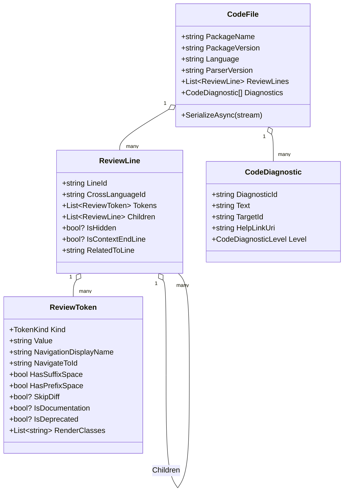

# 5. Token Model

> [!summary]
> The parser's output is a **`CodeFile`**: package metadata + a **tree of `ReviewLine`s** (each a list
> of `ReviewToken`s) + a list of `CodeDiagnostic`s. This is the cross-language APIView schema; the C#
> parser is just one producer of it.

All of these types live in the referenced **APIView** project, not in the parser itself:

- `CodeFile` — `src/dotnet/APIView/APIView/Model/CodeFile.cs`
- `ReviewLine` — `src/dotnet/APIView/APIView/Model/V2/ReviewLine.cs`
- `ReviewToken` — `src/dotnet/APIView/APIView/Model/V2/ReviewToken.cs`
- `TokenKind` — `src/dotnet/APIView/APIView/Model/V2/TokenKind.cs`
- `CodeDiagnostic` — `src/dotnet/APIView/APIView/Model/CodeDiagnostic.cs`



## CodeFile

The root object — the whole API review for one package.

Key members the parser sets:

| Member | Meaning |
|---|---|
| `PackageName` | Library/assembly name. |
| `PackageVersion` | Shipped version (see [[codefilebuilder#Package version]]). |
| `Language` | Always `"C#"` for this parser. |
| `ParserVersion` | `CodeFileBuilder.CurrentVersion` (e.g. `"29.91"`). |
| `ReviewLines` | The top-level lines (namespaces, dependency/internals sections). |
| `Diagnostics` | The `CodeDiagnostic[]` from the [[analysis-and-diagnostics|Analyzer]]. |

> [!note] Legacy fields
> `CodeFile` also carries older fields (`Tokens`, `Navigation`, `LeafSections`, `Version`, …) used by
> the flat-token format and other consumers. The tree-style C# parser does not populate them; they're
> omitted from the JSON because serialization ignores nulls/empties.

### Serialization

- **`SerializeAsync(Stream)`** — `System.Text.Json` with `DefaultIgnoreCondition = WhenWritingNull`,
  so null properties and empty collections are dropped. This keeps token files small (they're stored in
  Azure blob storage). Called by `Program.CreateOutputFile`.
- **`DeserializeAsync(Stream, ...)`** — used by APIView/tests to read a token file back; also runs
  `SanitizeTokenValues()` to strip stray newlines from text tokens.
- **`GetApiText()` / `GetApiOutlineText()`** — render the tree back to plain text (used for downloads,
  outlines, and test assertions).

## ReviewLine

One rendered line of the review. Lines nest via `Children` to mirror code structure.

| Member | Purpose |
|---|---|
| `LineId` | Stable unique id (from the symbol). Anchors comments, navigation, and diffs. Empty for pure punctuation/blank lines. |
| `CrossLanguageId` | Optional id linking the line to the equivalent line in another language's review. |
| `Tokens` | The `ReviewToken`s that make up the line's text. |
| `Children` | Nested lines (a namespace's types; a type's members). |
| `IsHidden` | Line is hidden by default (e.g. `[EditorBrowsable(Never)]`, explicit interface impls). |
| `IsContextEndLine` | This line closes a scope — the `}` of a type or namespace. |
| `RelatedToLine` | Ties a line to another (e.g. an attribute or trailing blank line to its owner) so it hides/shows together, important in diff view. |

Helper behavior worth knowing:

- **`AddToken` / `AppendApiTextToBuilder` / `ToString`** — build text from tokens, honoring spacing.
- **`IsEmpty`** — a line with no diff-relevant tokens (used to render blank separators).
- **Equality** is based on rendered text + `LineId` + `RelatedToLine`.
- Several members (`DiffKind`, `Indent`, `Processed`, …) are `[JsonIgnore]` runtime helpers used by
  APIView's renderer/differ and are **not** serialized.

### Why a tree?

A parent/child structure (instead of a flat token list) gives APIView:

- granular navigation (select a type → all its members),
- contextual diffing (a change is shown *within* its containing type),
- cross-language linking of a specific node,
- and smaller files. (Rationale is spelled out in `tools/apiview/parsers/CONTRIBUTING.md`.)

## ReviewToken

The smallest unit — a keyword, name, punctuation, literal, or comment.

| Member | Purpose |
|---|---|
| `Kind` | The [[#TokenKind]] (drives syntax styling). |
| `Value` | The literal text. |
| `NavigationDisplayName` | If set (with the line's `LineId`), the token appears in the nav panel. |
| `NavigateToId` | Makes the token a hyperlink to another line's `LineId` (cross-references). |
| `HasSuffixSpace` | Whether a space follows the token. Defaults to **true**; parser sets false for tight punctuation. |
| `HasPrefixSpace` | Whether a space precedes the token. Defaults to false. |
| `SkipDiff` | Exclude from diff calculations (e.g. dependency versions, package metadata). |
| `IsDocumentation` | Marks the token as part of a doc comment. |
| `IsDeprecated` | Marks a deprecated API. |
| `RenderClasses` | CSS-style class names for styling (e.g. `class`, `namespace`, `method`). |

**Factory methods** (used heavily by [[codefilebuilder|CodeFileBuilder]]):
`CreateTextToken`, `CreateKeywordToken` (also overloads taking a Roslyn `SyntaxKind` / `Accessibility`),
`CreatePunctuationToken`, `CreateTypeNameToken`, `CreateMemberNameToken`, `CreateLiteralToken`,
`CreateStringLiteralToken`, `CreateCommentToken`.

### TokenKind

```text
Text = 0, Punctuation = 1, Keyword = 2, TypeName = 3,
MemberName = 4, StringLiteral = 5, Literal = 6, Comment = 7
```

## CodeDiagnostic

A single guideline finding attached to the review. Produced by the
[[analysis-and-diagnostics|Analyzer]].

| Member | Purpose |
|---|---|
| `DiagnosticId` | Rule id (e.g. `AZC0012`). |
| `Text` | Human-readable message. |
| `TargetId` | The `LineId` the diagnostic points at. |
| `HelpLinkUri` | Optional URL to guideline docs. |
| `Level` | `CodeDiagnosticLevel` (Info / Warning / Error / Default). |

## Worked example

The review line `namespace Azure.Data.Tables {` serializes to roughly:

```json
{
  "LineId": "Azure.Data.Tables",
  "Tokens": [
    { "Kind": 2, "Value": "namespace", "HasSuffixSpace": true },
    { "Kind": 0, "Value": "Azure.Data.Tables", "NavigationDisplayName": "Azure.Data.Tables",
      "HasSuffixSpace": true, "RenderClasses": ["namespace"] },
    { "Kind": 1, "Value": "{", "HasSuffixSpace": true }
  ],
  "Children": []
}
```

(`Kind` 2 = Keyword, 0 = Text, 1 = Punctuation.) The full reference example lives in
`tools/apiview/parsers/CONTRIBUTING.md`.

## Next

See how the assembly is loaded in [[compilation-and-dependencies]].
